# Object Detection in an Urban Environment


## Goal

To classify and localize the cars, pedestrians and cyclists in camera input feed.

## Data

For this project, we will be using data from the [Waymo Open dataset](https://waymo.com/open/).

## Structure

### Data

### Data

The data we will use for training, validation and testing is organized as follow:
```
/home/workspace/data/waymo
    - training_and_validation - contains 97 files to train and validate your models
    - train: contain the train data (empty to start)
    - val: contain the val data (empty to start)
    - test - contains 3 files to test your model and create inference videos
```

The `training_and_validation` folder contains file that have been downsampled: we have selected one every 10 frames from 10 fps videos. The `testing` folder contains frames from the 10 fps video without downsampling.


## Local Setup

For local setup if you have your own Nvidia GPU, you can use the provided Dockerfile and requirements in the [build directory](./build).

Follow [the README therein](./build/README.md) to create a docker container and install all prerequisites.


### Download and process the data


**Note:** I used the Udacity Workspace, they already had the data processed ready to use.

The first goal of this project is to download the data from the Waymo's Google Cloud bucket to your local machine. For this project, we only need a subset of the data provided (for example, we do not need to use the Lidar data). Therefore, we are going to download and trim immediately each file. In `download_process.py`, you can view the `create_tf_example` function, which will perform this processing. This function takes the components of a Waymo Tf record and saves them in the Tf Object Detection api format. An example of such function is described [here](https://tensorflow-object-detection-api-tutorial.readthedocs.io/en/latest/training.html#create-tensorflow-records). We are already providing the `label_map.pbtxt` file.

You can run the script using the following command:
```
python download_process.py --data_dir {processed_file_location} --size {number of files you want to download}
```

You are downloading 100 files (unless you changed the `size` parameter) so be patient!


## Dataset


### Exploring dataset


| 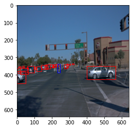  |  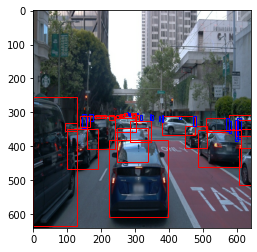 |
:-------------------------:|:-------------------------:
| 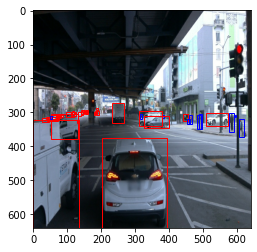  |  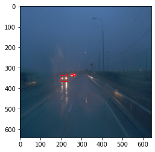 |
| 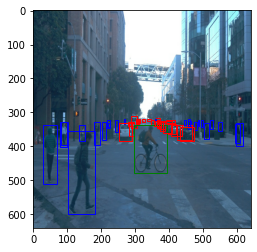  |  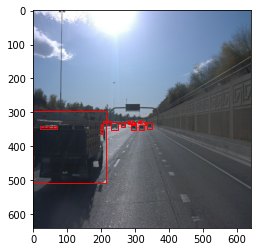 |


### Analysis


I have used random 5k samples from the dataset to analyse. I was confused about the file structure so in the beginning I ended up sampling from the train dataset.

```
# Finding number of objects in each image

labels = {1:0, 2:0, 4:0}
labels_dist={1:[], 2:[], 4:[]}

for batch in dataset.take(20000):
    try:
        count = {1:0, 2:0, 4:0}
        for i in batch['groundtruth_classes'].numpy():
            labels[i] += 1
            labels_dist[i].append(count[i])
    except Exception as err:
        print(err)


labels
{1: 345708, 2: 97358, 4: 2491}
```

It can be seen from the data that the data is significantly skewed towards cars and pedestrians. But the data doesn't have a huge number of cyclists.

### Create the training - validation splits

Split the data into 87% train, 10% validation and 3% test.
Use the following command to run the script once your function is implemented:
```
python create_splits.py --data-dir /home/workspace/data
```

### The config file


The config that we will use for this project is `pipeline.config`, which is the config for a SSD Resnet 50 640x640 model. You can learn more about the Single Shot Detector [here](https://arxiv.org/pdf/1512.02325.pdf).

First, let's download the [pretrained model](http://download.tensorflow.org/models/object_detection/tf2/20200711/ssd_resnet50_v1_fpn_640x640_coco17_tpu-8.tar.gz) and move it to `/home/workspace/experiments/pretrained_model/`.

We need to edit the config files to change the location of the training and validation files, as well as the location of the label_map file, pretrained weights. We also need to adjust the batch size. To do so, run the following:
```
python edit_config.py --train_dir /home/workspace/data/train/ --eval_dir /home/workspace/data/val/ --batch_size 2 --checkpoint /home/workspace/experiments/pretrained_model/ssd_resnet50_v1_fpn_640x640_coco17_tpu-8/checkpoint/ckpt-0 --label_map /home/workspace/experiments/label_map.pbtxt
```
A new config file has been created, `pipeline_new.config`.


### Training


Model and training hyperparameters are defined using a file, pipeline_new.config.
You can make changes in this config file, then move the `pipeline_new.config` to the `/home/workspace/experiments/reference` folder. Now launch the training process:
* a training process:
```
python experiments/model_main_tf2.py --model_dir=experiments/reference/ --pipeline_config_path=experiments/reference/pipeline_new.config
```
Once the training is finished, launch the evaluation process:
* an evaluation process:
```
python experiments/model_main_tf2.py --model_dir=experiments/reference/ --pipeline_config_path=experiments/reference/pipeline_new.config --checkpoint_dir=experiments/reference/
```

**Note**: Both processes will display some Tensorflow warnings, which can be ignored. You may have to kill the evaluation script manually using
`CTRL+C`.

To monitor the training, you can launch a tensorboard instance by running `python -m tensorboard.main --logdir experiments/reference/`. You will report your findings in the writeup.


### Augmentation

Explored the Object Detection API and applied many different augmentations. This is applied to allow the neural network to investigate more samples of data. Because augmentation changes the pixel dimension and values, the neural net is essentially looking at new pictures which allows it to learn more about cyclists and pedestrians.

Used various augmentation strategies:
1. random_horizontal_flip
2. random_crop_image
3. random_rgb_to_gray
4. random_adjust_contrast
5. random_jitter_boxes
6. random_adjust_brightness


| 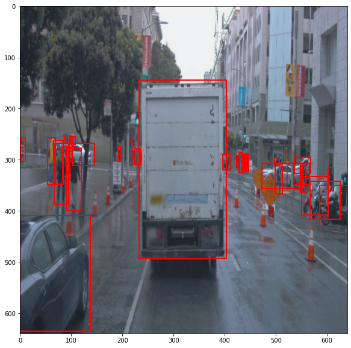  |  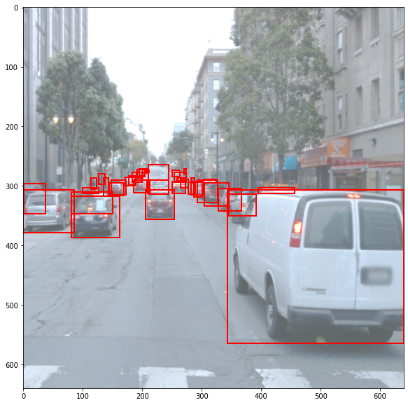 |
:-------------------------:|:-------------------------:
| 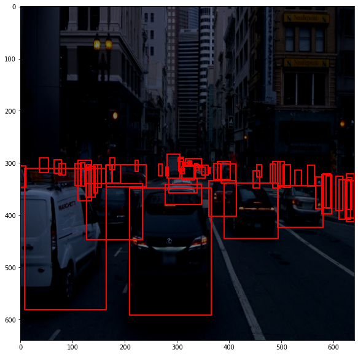  |  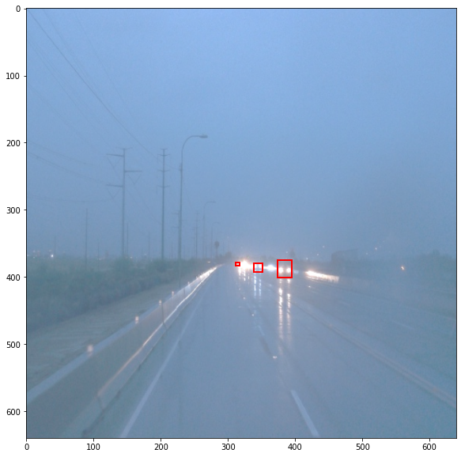 |


### Experiment

I experimented with a lot of combinations -
1.batch_size 8, iterations - 5000, learning rate - 0.04
2.batch_size 4, iterations - 4000, learning rate - 0.04
3.batch_size 4, iterations - 3000, learning rate - 3e-4

A high learning rate was detrimental to convergence because it kept bouncing around the local minima. Hence, when using learning rate of 0.04 the total loss kept varying between 2.3 and 3.4 even after 5000 iterations.

Training was stopped after 3000 iterations because between 3000 to 4000 iterations the total loss was still in the same range of 0.6-0.7. So if further training was done, it would lead to overfitting.

Used SGD with momentum. Rate decay: Cosine anealing.

This is one worked best with the resource crunch.


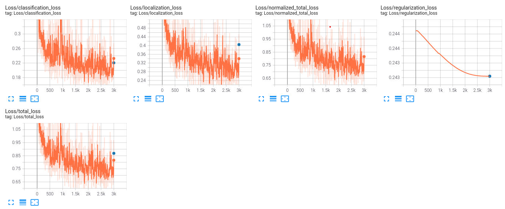


### Creating an animation

#### Export the trained model

Modify the arguments of the following function to adjust it to your models:

```
python experiments/exporter_main_v2.py --input_type image_tensor --pipeline_config_path experiments/reference/pipeline_new.config --trained_checkpoint_dir experiments/reference/ --output_directory experiments/reference/exported/
```

This should create a new folder `experiments/reference/exported/saved_model`. You can read more about the Tensorflow SavedModel format [here](https://www.tensorflow.org/guide/saved_model).

Finally, you can create a video of your model's inferences for any tf record file. To do so, run the following command (modify it to your files):
```
python inference_video.py --labelmap_path label_map.pbtxt --model_path experiments/reference/exported/saved_model --tf_record_path data/waymo/test/segment-12200383401366682847_2552_140_2572_140_with_camera_labels.tfrecord --config_path experiments/reference/pipeline_new.config --output_path animation.gif
```

## Test results


## Future Work

1. More time can be spent on tuning the hyperparameters. Due to limited resources only, I had to keep it restricted to a batch size of 4 and iterations to 3000
